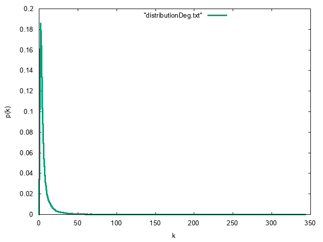
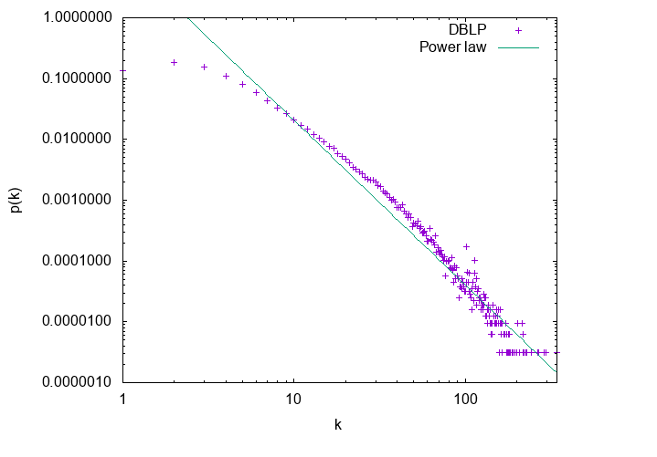
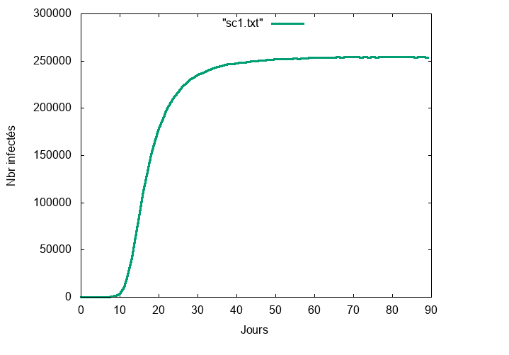
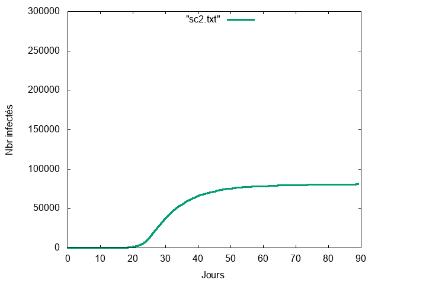
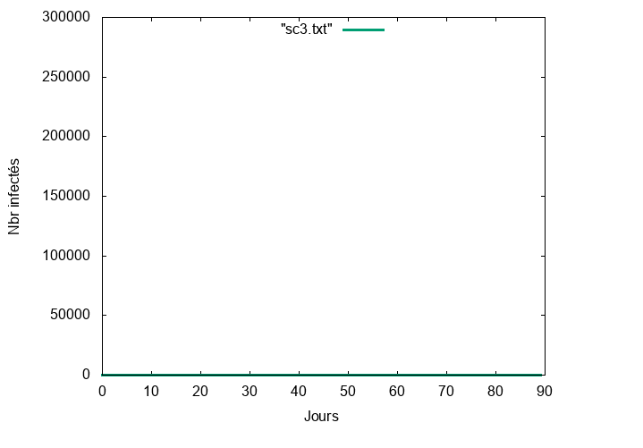
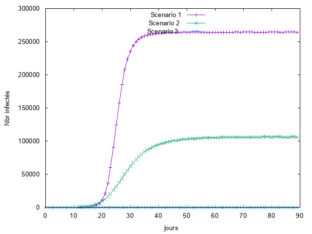
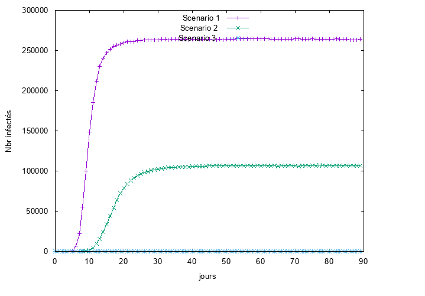

# Mesures de réseaux d'interaction

`Introduction: `

Ici nous allons analyser un réseau de collaboration scientifique en informatique pour mesurer un certain nombre de caractéristiques qui constituent ce réseau.  On extrait le réseau de DBLP, disponible sur SNAP(Stanford Network Analysis Project). 
Pour se faire, on utilise GraphStream qui permet de mesurer de nombreuses caractéristiques d'un réseau. La plupart de ces mesures sont implantées comme des méthodes statiques dans la classe Toolkit.

_`1- Lecture des données avec GraphStream :`_

Pour commencer, nous téléchargeons le fichier contenant les données (la structure de notre réseau)  de DBLP (com-dblp.ungraph.txt.gz) , puis pour le lire nous avons instancier un FileSourceEdge() de GraphStream qui sait lire le format de graphique type arêtes (notre fichier com-dblp.ungraph.txt), et on lu notre fichier en utilisant la fonction readAll()  qui fait la lecture du fichier en entier et en une seule instruction.

_`2- Les Mesure de base du réseau :`_

Nous avons fait quelques mesures sur le graphe en utilisant les méthodes existantes de graphStream. 

_1- Nombre de noeuds :_

Pour trouver le nombre de noeuds de notre graphe, nous avons utilisé la fonction getNodeCount()  qui renvoit le nombre de noeuds du graphe en question (notre graphe) .
le nombre de noeud de ce graphe est (`N`) : **317080**

_2- Nombre de liens (arêtes):_

Pour trouver le nombre de liens de notre graphe, nous avons utilisé la fonction getEdgeCount()  qui renvoit le nombre de liens (arêtes) du graphe en question (notre graphe) .
le nombre de liens de ce graphe est (`L`) : **1049866**

_3- Degré moyen:_

Pour trouver le degré moyen de notre graphe, nous avons utilisé la fonction averageDegree(notre graphe) de la classe Toolkit qui renvoit le degré moyen du graphe passer en paramétre (notre graphe) .
le degré moyen de ce graphe est (`<k>`) : **6.62208890914917**

_3- Coefficient de clustering:_ 

Pour trouver le coefficient de clustering qui est la moyenne du coefficient de clustering de tous les sommets qui ont un degré supérieur ou égal à 2  de notre graphe, nous avons utilisé la fonction averageClusteringCoefficient(notre graphe) de la classe Toolkit qui renvoit le degré moyen du graphe passer en paramétre .
le coefficient clustering est (`<C>` ): **0.6324308280637396**

_1-2-_  la probabilité qu'un noeud quelconque du graphe soit relié à un autre noeud dans le cas d'un graphe aléatoire G(N,p) est la même pour tous les noeuds ce qui veut dire que la valeur du coefficient de clustering vaut la meme chose  que cette probabilité => `Ci = p`.
sachant que `p = <k>/N`, Alors le coefficient de clustering  pour un réseau aléatoire de la même taille et du même degré moyen est la moyenne du coefficient de clustering de tous les sommets qui ont un degré supérieur ou égal à 2  =  **0.000020884599814** 

_`3 - La Connexité :`_

_3-1-_ Un réseau connexe est un réseau dont tout les noeuds sont connectés entre eux et pour le vérifier sur notre graphe, Il existe une fonction de GraphStream qui renvoit true si le graphe est connexe, sinon false, en appliquant cette fonction Toolkit.isConnected(notre graphe) sur notre graphe, elle nous renvoit true alors ce graphe est connexe.

_3-2-_ On a vu en cours que : pour qu'un réseau aléatoire soit connexe il faut vérifier la notion du degré moyen du graphe qui doit être supérieur `<k>`  au ln(Nombre de noeud du graphe) `<k> > ln(N)`. Alors pour un réseau aléatoire de même taille et de même degré moyen cela donne :
`<k> = 6.62208890914917 & 
ln(N) = 12.666909387`
On voit bien que `〈k〉> lnN(p>lnN/N)`.
 Alors le réseau aléatoire de même taille et de même degré moyen n'est pas connexe car l'inégalité n'est pas vérifier.

_3-3-_ Alors pour qu'un réseau aléatoire avec cette taille devient connexe il faut que le degré moyen de ce réseau soit supérieur à 12.666909387

_`4- La distribution des degrés :`_

La distribution des degrés est la probabilité qu'un noeud choisi au hasard ait degré `k`.
Alors pour calculer la distribution des degrés, nous avons créé une méthode disDeg() qui calcul la probabilité  qu’un noeud choisi au hasard ait degré `k`, à cet effet nous avons fait appel a la fontion
`Toolkit.degreeDistribution(notre graph)` qui renvoie un tableau où chaque indice de cellule représente le degré, et la valeur de la cellule le nombre de noeud ayant ce degré, nous avons stocké son résultat dans un tableau d'entiers degreProba[] 
et puis on a créé un fichier texte ou chaque ligne représente  l'association de la probabilité qu'un noeud choisi au hasard ait degré `k` à son degré `k` par exemple
`6 0.05796013624321938` => `0.05796013624321938` correspond à la distribution de degré `6`.

Alors à partir du fichier généré  `distributionDeg.txt` contenant la distribution des degrés, on trace le graphe correspondant à la probabilité qu’un noeud choisi au hasard ait degré `k` en fonction de son degré `k`.
comme on peut le voir en :

_`Echelle linéaire :`_

Pour le générer nous avons utilisé le script : `scriptDistributionDegreLine.gnuplot`

_`Echelle log-log :`_

Pour le générer j'ai utilisé le script : `scriptDistributionDegreLog.gnuplot`

En analysant le graphe on peut voir une ligne droite pendant plusieurs ordres de grandeur. Donc cela nous conduit 
à dire que la distribution de degré suit une loi de puissance.

_`la distribution de Poisson :`_

Pour le générer nous avons utilisé le script : `scriptDistributionDePoisson.gnuplot`

_`loi de puissance :`_

Pour le générer nous avons utilisé le script : `scriptLoiDePuissance.gnuplot`

d'aprés le fit (fichier générer par la commande `fit` de `gnuplot`) on peut voir que `gamma=  2.70539  +/- 0.04437` 

_`5- La distance:`_

La distance moyenne d'un graphe est la somme des distances d'un noeud (noeud source) vers tous les autres noeuds du grphe
Alors pour trouver la distance moyenne de notre échantillon de 1000 noeuds, nous avons créé une méthode qui fait ce calcul, elle prend 1000 noeuds du reseau au hasard
 puis on fait la somme de ses distances vers les autres noeuds du graphe.

Alors le résultat sera : **6.792355134350952**.

Donc avec une telle distance moyenne on peut dire que l'hypothèse de six degrés de séparation est confirmé.

Pour savoir s'il s'agit d'un réseau "petit monde" ? Oui est un réseau petit monde car la distance entre deux
nœuds choisie au hasard est courte.

La distance moyenne dans un réseau aléatoire avec les memes caractéristiques :
`d = ln(N)/ln(k) = ln(317080)/ln(6.62208890914917) = 6.70061181886`

_`la distribution des distances :`_

Pour le générer nous avons utilisé le script : `scriptDistributionDistances.gnuplot`

 On peut voir d'après la courbe tracé que son sommet indique le plus grand nombre de
noeuds qui partage la meme distance avec un autre noeud. Et d'après le graphe on peut déduire que
 la loi de distribution de distance suit une loi Binomiale.

_`6- Le générateurs de GraphStream :`_

_`a méthode d'attachement préférentiel (Barabasi-Albert) :`_

Pour générer le graphique en utilisant la méthode d'attachement préférentiel (Barabasi-Albert) 
On a créé la méthode `generateurBarabasi(int nbNoeuds, int degreeMoyen)` qui prend en paramètre le nombre de noeuds du graphe ainsi le degré moyen 

Les mesures que nous avons faites sur ce graphe se présentent ainsi : 

le nombre de noeud de ce graphe est : **317082**

le nombre de liens de ce graphe est : **1267694**

le degré moyen de ce graphe est : **7.996001243591309**

le clustering coefficient est : **4.34868464589236E-4**

_`Le générateur aléatoire :`_

Pour générer le graphique en utilisant le générateur aléatoire de graphe, 
nous avons créé la méthode `generateurRandom(int nbNoeuds, int degreeMoyen)` qui prend en paramètre le nombre de noeuds du graphe ainsi le degré moyen

Les mesures que nous avons faites sur ce graphe se présentent ainsi :

le nombre de noeud de ce graphe généré aléatoirement est : **317088**

le nombre de liens de ce graphe généré aléatoirement est : **1109349**

le degré moyen de ce graphe générer aléatoirement est : **6.997105121612549**

le clustering coefficient de ce graphe généré aléatoirement est : **3.211396337453094E-5**

_ Comparaison entre le réseau de Collaborateur et celui généré avec le générateur aléatoire :

le coefficient de clustering du réseau collaborateur est élevé par rapport au réseau aléatoire.

# Propagation dans des réseaux

_`Introduction :`_

Les consignes sont les mêmes que pour le premier TP. On travaille avec les mêmes données et la problématique est proche.

Nos collaborateurs scientifiques communiquent souvent par mail. Malheureusement pour eux, les pièces jointes de ces mails contiennent parfois des virus informatiques.
On va étudier la propagation d'un virus en étudiant plusieurs hypothéses.

**_1-  Le Taux de propagation & le seuil épidémique :_**

_`1-1 Le Taux de  propagation du virus :`_
On définit le taux de propagation dans le but de prédire si la maladie persiste.
Alors :

Le taux de propagation du virus `λ`  est la probabilité `β` de transmettre le virus dans un intervalle de temps (unité de temps en jours par exemple) qu'on doit diviser sur un taux `µ` pour
redevenir susceptibles (c'est le taux pour que les individus infectieux guérissent) =>
`λ = β / µ = (1/7) / (1/14)` d'ou :

` β = 1/7` est la probabilité d'infecter un collaborateur car un individu envoie en moyenne un mail par semaine à chacun de ses collaborateurs.

` µ = 1/14` est la probabilité qu'un individu met à jour son anti-virus car il le met à jour 2 fois par mois et pour qu'il devient susceptible il lui faut 14 jours .

Donc, le taux de propagation `λ = β / µ = (1/7) / (1/14) = 2`

_`1-2 Le seuil épidémique du réseau :`_

Alors comme le taux de propagation ne dépend pas du réseaux alors on doit chercher le seuil épidémique du réseau `λc` d'ou :  `λc = <k> / <k²>`

si  `λ > λc`  alors la maladie persiste.

Si `λ < λc` alors la maladie disparaît

**`A-Reseau DBLP :`**

Pour trouver la valeur de la dispersion des degrés `<k²>` j'ai créé une méthode dispersionDegre() qui fait le calcul de cette valeur
( multiplie le carré de chaque degré des noeuds fois le nombre de noeuds ayant ce degré divisé par le nombre de noeuds du graphe).
puis j'ai fais le calcul du seuil épidémique du réseau qui vaut alors
`λc = <k> / <k²> = 6.62208890914917 / 144.00627601867035 = 0.045984724362225844`
d'ou `<k> = 6.62208890914917`  et  `<k²> = 144.00627601867035`.

**`B-  Reseau Aléatoire :`**

Dans un réseau aléatoire le seuil épidémique du réseau `λc = 1 / (<k> + 1) `

D'où le seuil épidémique du réseau de même degré moyen serait
`λc = 1 / (<k> + 1) = 1 / 7.62208890914917 = 0.13119762993051035`

On voit bien que la valeur du seuil épidémique du réseau de même degré moyen est plus grand dans un réseau aléatoire.

**_2 - Simulation de la propagation du virus :_**

_`1- Scenario 1 :`_

La Simulation sur la propagation du virus jour par jour pendant trois mois avec le premier scénario lorsqu'on ne fait rien pour empêcher l'épidémie.
voici le graphe correspondant. Pour se faire, nous avons créé une méthode prpagationSc1() qui calcule cette simulation, au début on prend
un patient zéro (le premier ifecté) au hasard dans notre réseau (graphe)  on l'ajoute dans la liste des malades puis on boucle sur le nombre de jours de notre simulation qui est 3 mois
(90 jours)  puis on prend tous les voisins de cet individu (ses collaborateurs) si la probabilité
de 1/7 de les infecté (voisins de cet individu(noeud)) est vérifie, alors tous ses voisins seront infectés puis on les ajoutent dans une liste des malades, puis on vérifier si le premier individu infecté n'est y pas dans la  2eme liste `copieMalades` des infecté alors on l'ajoute
on vide la premiere liste `malades` dans le but de faire une vérification avec une probabilité de 1/14 si chaque individu (les malades) de la liste `copieMalades` sont  guérit aprés une mise a jour effectué avec une probabilité de 1/14 s'ils restent toujours infectés on les rajoutent alors dans
la premiére liste `Malades` puis on stock le nombre d'individus infectés ce jour là commme valeur de la case "jour" du tableau infections.

_`2-Scenario 2 :`_

La Simulation sur la propagation du virus jour par jour pendant trois mois avec
le deuxiéme scénario lorsqu'on réussit à convaincre 50 % des individus de mettre à jour en permanence leur anti-virus (immunisation aléatoire).
Voici le graphe correspondant. Pour se faire, nous avons créé une méthode prpagationSc2() qui calcul cette simulation.
Pour commencer on prend la moitier de des employés (50% des collaborateurs) qui seront immunisés ( ils mettent à jour en permanence leur anti-virus)
puis on distingue un patient zéro (le premier ifecté) au hasard dans l'autre moitié de l'ensemble des noeuds du graphe qui ne sont pas immunisés
on l'ajoute dans la liste des malades puis on boucle sur le nombre de jours de notre simulation qui est 3 mois
(90 jours)  puis on prend tous les voisins de cet individu (ses collaborateurs) et on exclu les noeuds qui font partie de l'ensemble des noeuds deja immunisés, si la probabilité
de 1/7 de les infecté (voisins de cet individu(noeud)) est vérifie, alors tous ses voisins seront infectés puis on les ajoutent dans une liste des malades, puis on vérifie si le premier individu infecté n'est y pas dans la  2eme liste `copieMalades` des infectés alors on l'ajoute
on vide la premiere liste `malades` dans le but de faire une vérification avec une probabilité de 1/14 si chaque individu (les malades) de la liste `copieMalades` sont  guérit aprés une mise a jour effectué avec une probabilité de 1/14 s'ils restent toujours infectés on les rajoutent alors dans
la premiére liste `Malades` puis on stock le nombre d'individus infectés ce jour là commme valeur de la case "jour" du tableau infections.

_`3-Scenario 3 :`_

La Simulation sur la propagation du virus jour par jour pendant trois mois avec
le troisiéme scénario lorsqu'on réussit à convaincre 50 % des individus de convaincre un de leurs contacts de mettre à jour en permanence son anti-virus (immunisation sélective).
Pour se faire, nous avons fait le même principe avec les deux premiers scénarios juste dans la méthode qui nous génére les données de ce graphe, nous avons travaillé sur une seule liste des malades, et nous avons selectionné au hasard 50% des individus(Noeuds) du reseau (graphe) ainsi chaque individu de ce groupe a pu convaince un de ses collaborateurs (un voisin au hasard) a mettre à jour son anti-virus en permanance alors ce dernier il devient immunisé. Puis on cherche un patient zero infecté qui ne fait pas partie de l'ensemble des immunisés.   
Si la probabilité  de 1/7 de les infecté (voisins de cet individu(noeud)) est vérifié, alors tous ses voisins seront infectés puis on les ajoutent dans une liste des malades,
on fait une vérification avec une probabilité de 1/14 si chaque individu (les malades) de la liste `malades` sont  guérit aprés une mise à jour effectué avec une probabilité de 1/14 alors on les suppriment de la liste des malades et sinon ils restent toujours infectés puis on stock le nombre d'individus infectés ce jour là commme valeur du tableau infections.

**_1-Calcule le degré moyen des groupes 0 et 1 :_**

_`Degré moyen le scenario 2 :`_

groupe 0 = `6.645288255329885` , groupe 1 = `6.598889870064337`

_`Degré moyen le scenario 3 :`_

groupe 0 = `6.622536899205248` , groupe 1 = `7.9264415465717875`

**_4-Suppression des noeuds immunisés du réseau :_**

le seuil épidémique du réseau modifié pour la stratégies
d'immunisation du scenario 02 est de valeur  `0.08850174749352241`

le seuil épidémique du réseau modifié pour la stratégies
d'immunisation du scenario 03 est de valeur `0.6036244131479861`

On voit bien que le seuil épidémique des deux scénarios 02 et 03 sont supérieurs àu seuil épidémique du reseau initial.

**_5-Suppression des noeuds immunisés du réseau :_**

Voici ci-dessous les résultats obtenu pour chacun des 2 réseaux :

_`A-Réseau aléatoire`_

`B-Réseau avec la méthode d'attachement préférentiel : `

Comme vous le voyez, on peut le voir dans les graphes générés que le virus se propage de la même maniére dans les deux réseaux. alors on peut dire que l'immunisation selective reste favorisé dans tous les cas.
